# 🎓 LearnHub — An Online Course Platform

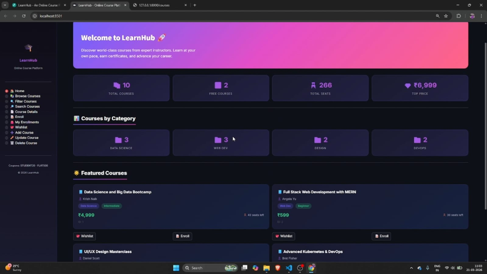

**A full-featured RESTful API built with FastAPI for managing an online course marketplace — complete with enrollment workflows, discount logic, wishlist management, and an interactive Streamlit frontend.**


---

## 📌 Overview

**LearnHub** is an Online Course Platform backend built with **FastAPI** as part of a mega internship project. It covers all core backend concepts — from basic CRUD to advanced search, sort, pagination, and multi-step workflows — across **20 fully functional API endpoints**. The project also includes a **Streamlit-based frontend** that consumes the API for a complete full-stack experience.

---

## 🏗️ Architecture & Tech Stack

| Layer | Technology |
|-------|-----------|
| **Backend Framework** | FastAPI (v0.135.1) |
| **Data Validation** | Pydantic v2 with `BaseModel`, `Field`, `EmailStr`, `model_validator` |
| **Server** | Uvicorn (ASGI) |
| **Frontend** | Streamlit (consuming the REST API) |
| **Language** | Python 3.10+ |

---

## 📁 Project Structure

```
Online_Course_Platform_FastAPI/
├── main.py               # Core FastAPI backend — all 20 endpoints
├── models.py             # Pydantic models (EnrollRequest, NewCourse)
├── frontend.py           # Streamlit frontend application
├── requirements.txt      # Python dependencies
├── assets/
│   └── images/           # Swagger UI & Streamlit screenshots
└── README.md
```

---

## 🚀 Backend API — `main.py` (Detailed Breakdown)

The backend is the heart of this project. It implements **20 endpoints** organized by difficulty level and follows strict route-ordering rules (static routes before dynamic `/{id}` routes).

### 📦 In-Memory Data Store

The API uses in-memory Python lists to simulate a database:

- **`courses`** — 10 pre-loaded courses across 4 categories (Data Science, Web Dev, Design, DevOps) with attributes: `id`, `title`, `instructor`, `category`, `level`, `price`, and `seats_left`.
- **`enrollments`** — Dynamically populated enrollment records.
- **`wishlist`** — User's wishlisted courses.

### 🟢 Beginner Level (Q1–Q5) — GET Endpoints & Data Setup

| # | Endpoint | Method | Description |
|---|----------|--------|-------------|
| 1 | `/` | `GET` | Welcome message |
| 2 | `/courses` | `GET` | Returns all courses with total count and aggregate seats |
| 3 | `/courses/summary` | `GET` | Analytics — total courses, free count, most expensive course, total seats, category breakdown |
| 4 | `/enrollments` | `GET` | All enrollment records with count |
| 5 | `/courses/{course_id}` | `GET` | Fetch a single course by ID (404 if not found) |

### 🔵 Easy Level (Q6–Q10) — Pydantic Models, POST & Helpers

| # | Endpoint / Feature | Description |
|---|----------|-------------|
| 6 | `EnrollRequest` model | Pydantic validation: `student_name` (min 2), `course_id` (gt 0), `email` (EmailStr), `payment_method`, `coupon_code`, `gift_enrollment` + `recipient_name` with custom `model_validator` |
| 7 | `find_course()` / `calculate_enrollment_fee()` | **Helper functions** — early-bird discount (10% if seats > 5), coupon codes (`STUDENT20` = 20% off, `FLAT500` = ₹500 off), applied sequentially |
| 8 | `/enrollments` | `POST` — Validates course, checks seat availability, calculates discounts, decrements seats, returns detailed enrollment record |
| 9 | Gift enrollment | If `gift_enrollment=True`, requires `recipient_name` — enforced via Pydantic `model_validator` |
| 10 | `/courses/filter` | `GET` — Multi-parameter filtering by `category`, `level`, `max_price`, `has_seats` using `is not None` pattern |

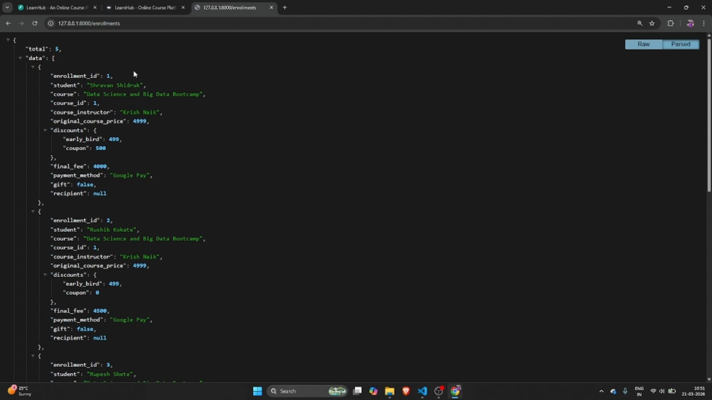

### 🟡 Medium Level (Q11–Q15) — Full CRUD & Wishlist Workflow

| # | Endpoint | Method | Description |
|---|----------|--------|-------------|
| 10 | `/courses` | `POST` | Add new course (duplicate title check, auto-ID, 201 status) |
| 11 | `/courses/{course_id}` | `PUT` | Update price/seats (partial update, 404 handling) |
| 12 | `/courses/{course_id}` | `DELETE` | Safe delete — blocks deletion if students are enrolled |
| 13 | `/wishlist/add` | `POST` | Add course to wishlist (duplicate check) |
| 14 | `/wishlist` | `GET` | View wishlist with total price of all items |
| 15 | `/wishlist/{course_id}` | `DELETE` | Remove from wishlist |

### 🔴 Hard Level (Q16–Q20) — Search, Sort, Pagination & Browse

| # | Endpoint | Method | Description |
|---|----------|--------|-------------|
| 16 | `/courses/search` | `GET` | Keyword search across `title`, `instructor`, `category` (case-insensitive) |
| 17 | `/courses/sort` | `GET` | Sort by any field with `asc`/`desc` order |
| 18 | `/courses/page` | `GET` | Pagination with `page` & `limit` params |
| 19 | `/enrollments/search`, `/sort`, `/page` | `GET` | Full search, sort & pagination for enrollments |
| 20 | `/courses/browse` | `GET` | **All-in-One endpoint** — keyword + category + level + max_price + sort + pagination with full metadata response |

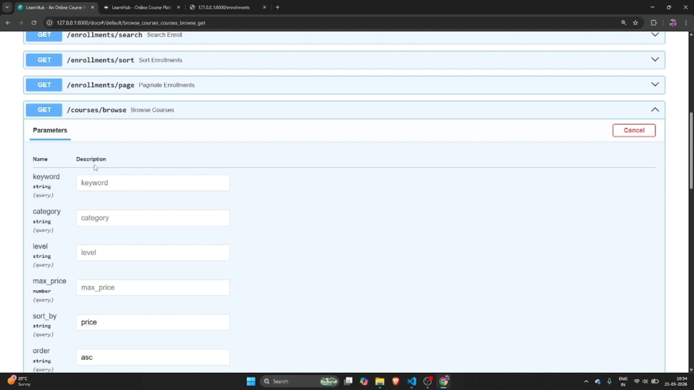

### 🧠 Key Business Logic

```
Enrollment Fee Calculation:
  Base Price
  → Early Bird Discount (10% if seats_left > 5)
  → Coupon Code (STUDENT20 = 20% off | FLAT500 = ₹500 off)
  → Final Fee = max(0, calculated_amount)
```

---

## 📋 Pydantic Models — `models.py`

Separated into a dedicated file for **code modularity**:

```python
class EnrollRequest(BaseModel):
    student_name: str = Field(..., min_length=2)
    course_id: int = Field(..., gt=0)
    email: EmailStr
    payment_method: str = Field(default='card')
    coupon_code: Optional[str] = ""
    gift_enrollment: bool = False
    recipient_name: str = ""

    @model_validator(mode="after")  # Custom validation for gift enrollments
    def validate_gift(cls, values): ...

class NewCourse(BaseModel):
    title: str = Field(..., min_length=2)
    instructor: str = Field(..., min_length=2)
    category: str = Field(..., min_length=2)
    level: str = Field(..., min_length=2)
    price: int = Field(..., ge=0)
    seats_left: int = Field(default=10, ge=0)
```

---

## 📡 Swagger UI — All Endpoints

The complete API is documented and testable at `http://127.0.0.1:8000/docs`:

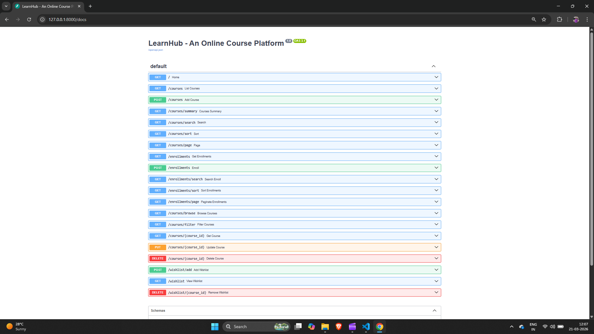

---

## 🖥️ Frontend — Streamlit

A companion **Streamlit** app (`frontend.py`) provides a polished UI that consumes all backend endpoints. It features a dark-themed design with course browsing, filtering, enrollment with balloon animations, wishlist management, and full CRUD operations.

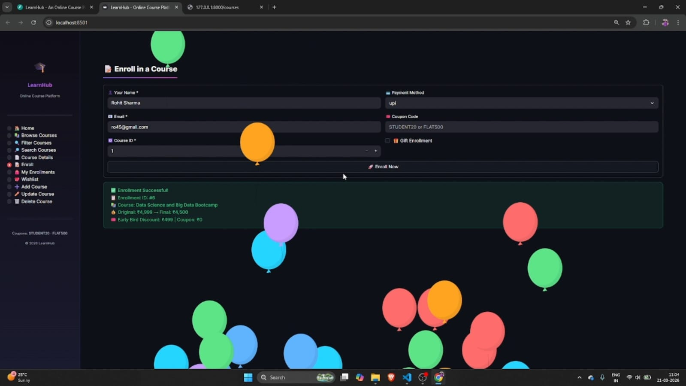

---

## ⚡ Quick Start

### 1. Clone & Setup

```bash
git clone <repository-url>
cd Online_Course_Platform_FastAPI
python -m venv venv
venv\Scripts\activate        # Windows
pip install -r requirements.txt
```

### 2. Run the Backend

```bash
uvicorn main:app --reload
```

> API available at `http://127.0.0.1:8000` | Swagger docs at `http://127.0.0.1:8000/docs`

### 3. Run the Frontend (Optional)

```bash
streamlit run frontend.py
```

> Frontend available at `http://localhost:8501`

---

## 📸 More Screenshots

### Backend API Responses

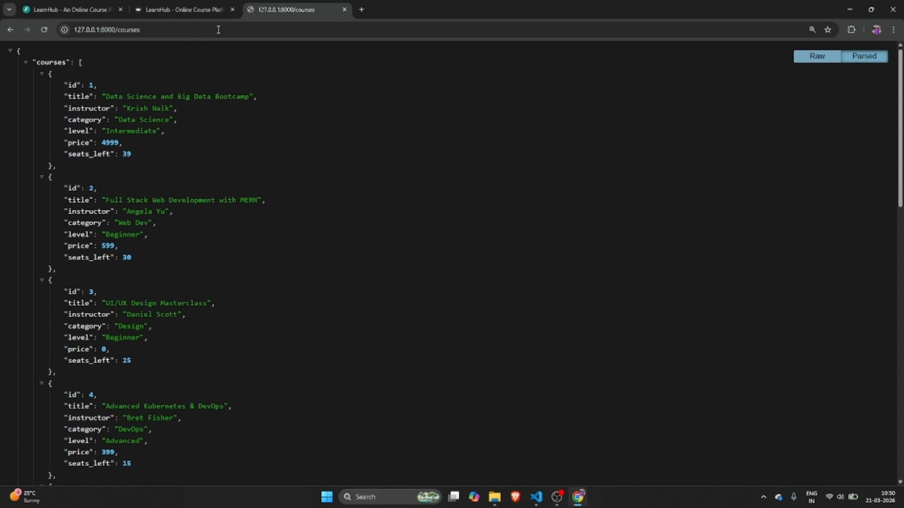
*GET `/courses` — JSON response with all course data*

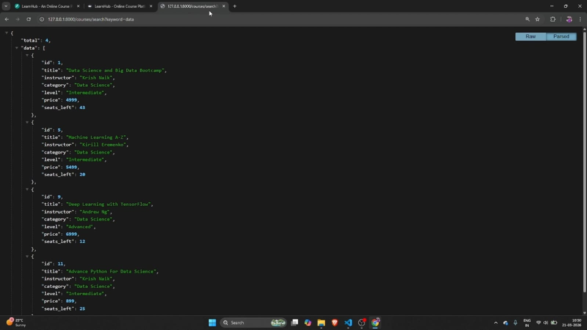
*Keyword-based course search*

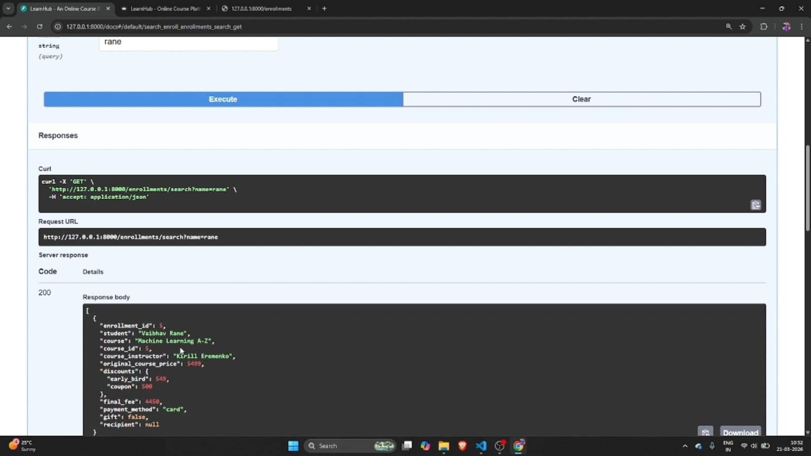
*Searching enrollments by student name*

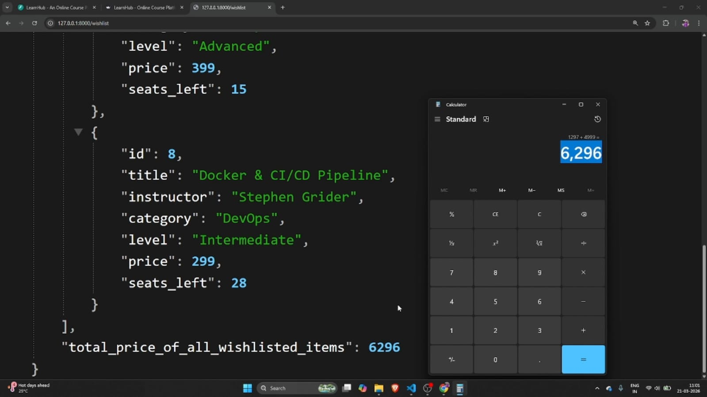
*Wishlist with total value calculation*

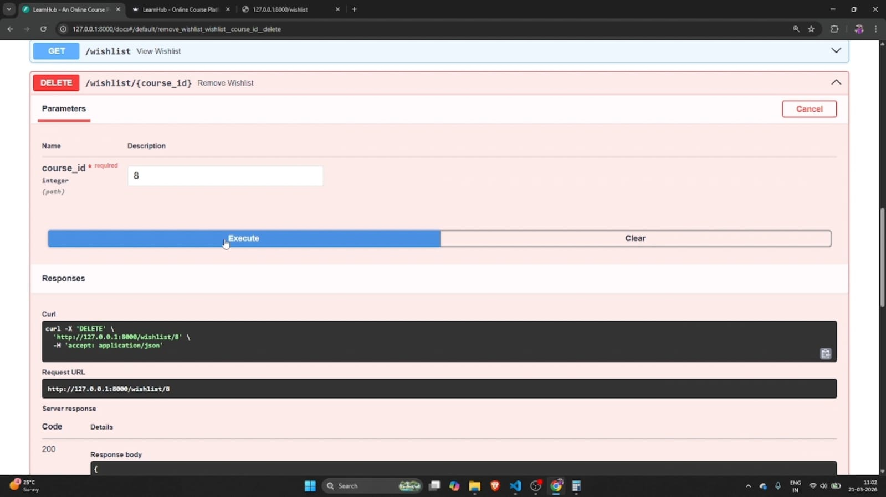
*Removing a wishlisted item*

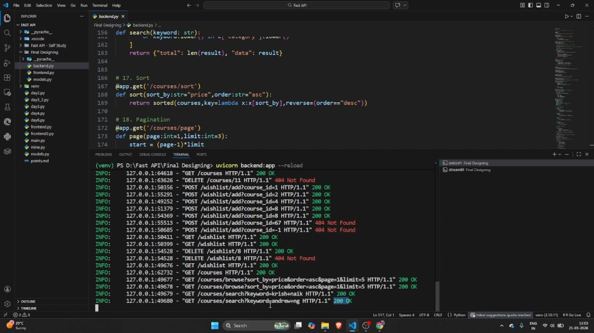
*Uvicorn terminal showing request logs with status codes*

### Streamlit Frontend

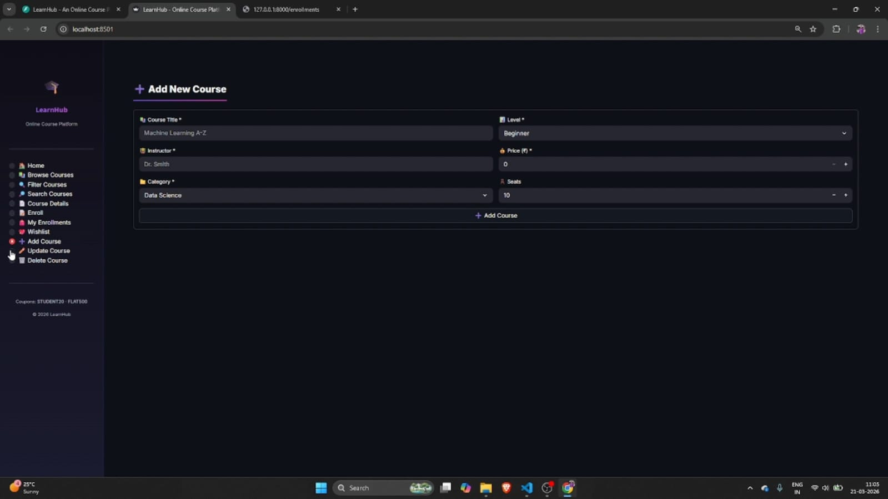
*Add Course via Streamlit*

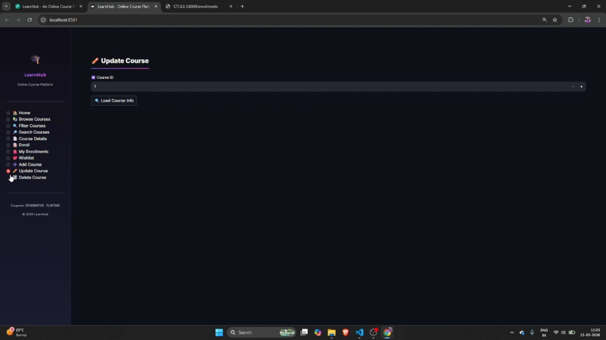
*Update Course via Streamlit*

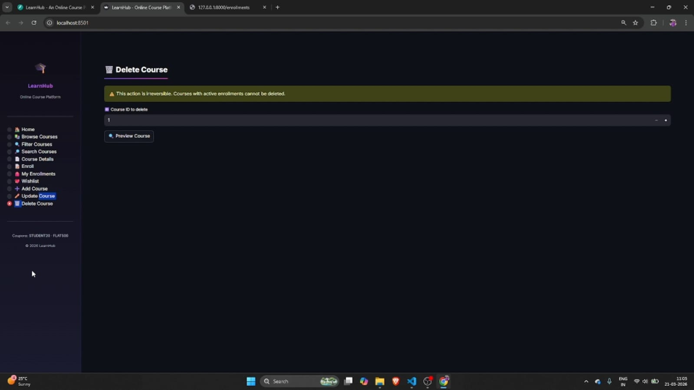
*Delete Course via Streamlit*

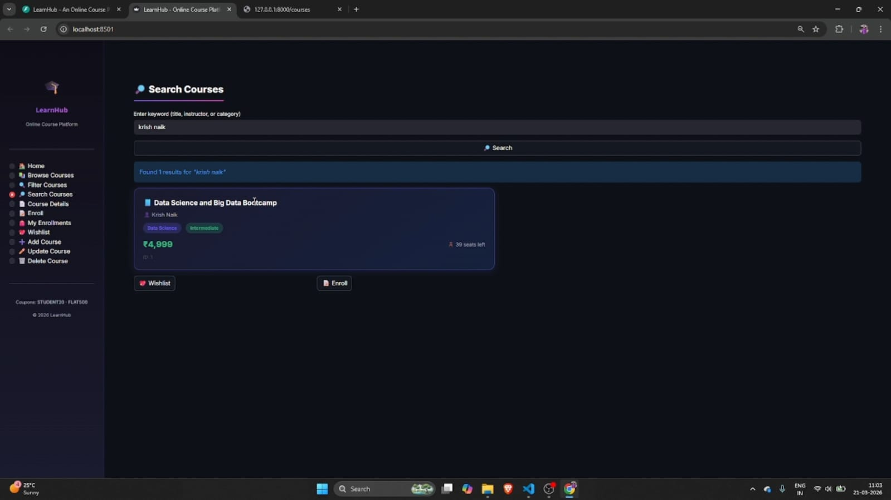
*Search Courses via Streamlit*

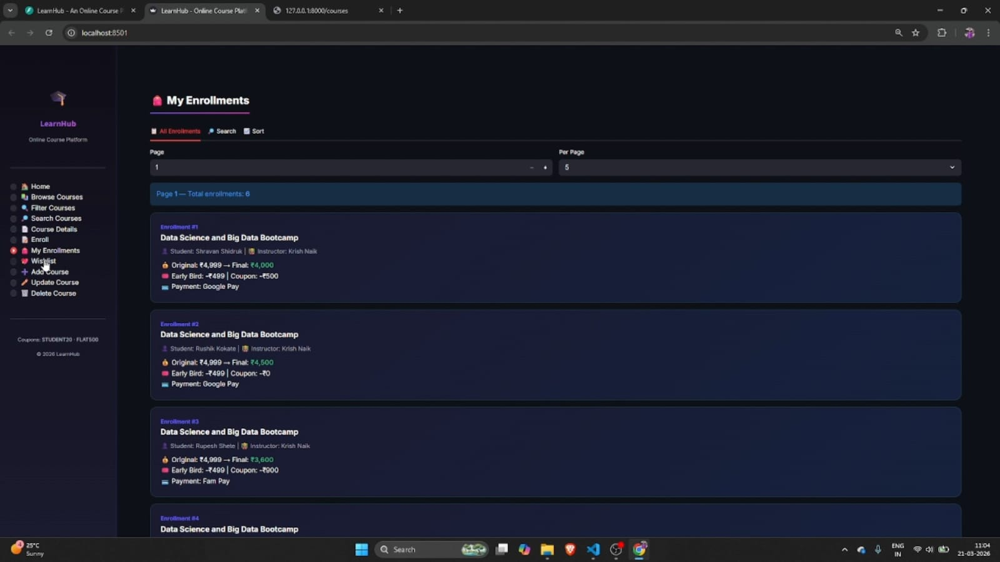
*Enrollments view in Streamlit*

---

## 📝 Concepts Covered

| Day | Concept | Implementation |
|-----|---------|---------------|
| Day 1 | GET endpoints, JSON responses | Home, list all, get by ID, summary |
| Day 2 | POST + Pydantic validation | Enrollment with `Field`, `EmailStr`, `model_validator` |
| Day 3 | Helper functions, filters | `find_course()`, `calculate_enrollment_fee()`, `filter_courses_logic()` |
| Day 4 | Full CRUD (POST, PUT, DELETE) | Add/update/delete courses with status codes & safety checks |
| Day 5 | Multi-step workflow | Wishlist → Add → View → Remove (3 connected endpoints) |
| Day 6 | Search, Sort, Pagination | Keyword search, sorted(), page/limit, all-in-one `/browse` |

---

## 👤 Author

| Field | Details |
|-------|---------|
| **Author** | Shravan Santosh Shidruk |
| **Intern ID** | IN226039402 |
| **Organization** | Innomatics Research Labs |
| **Project** | FastAPI Mega Project — LearnHub: An Online Course Platform |

---

**Built with ❤️ By Shravan Shidruk using FastAPI** | © 2026 LearnHub — All Rights Reserved
